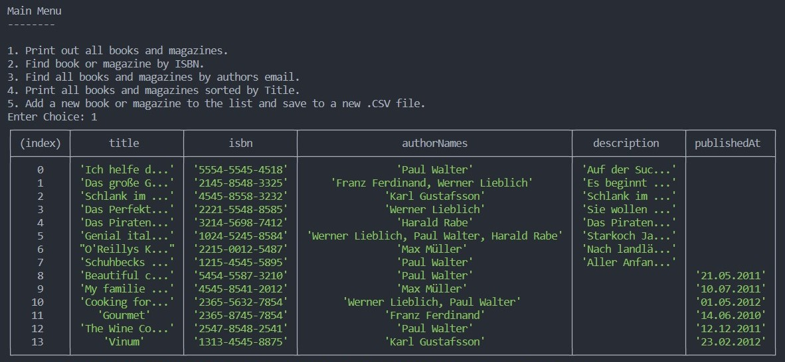

# RaftLabs - Assignment 1

For viewing Assignment 2, click [here](https://github.com/mukherjeearnab/raftlabs-assignment/tree/assignment2).

## Project Definition

-   Write software that reads the CSV data (of books, magazines, and authors) given on the next page.
-   Print out all books and magazines (on either console UI) with all their details (with a meaningful output format).
-   Find a book or magazine by its ISBN.
-   Find all books and magazines by their authors’ email.
-   Print out all books and magazines with all their details sorted by title. This sort should be done for books and magazines together.
-   Add a book and a magazine to the data structure of your software and export it to a new CSV file.

## Usage

### Prerequisites

To test the app, first install the dependencies using:

    npm install

Once the dependencies have been installed, run:

    npm start

to start the CLI application.

### Instructions

Once you run `npm start`, a main menu will appear, based on the project definitions. Enter the Menu choice, using any number between `1 to 5`.

#### 1. Print out all books and magazines.

Selecting this option will print all the books and magazines, with their respective details in a tabular format.

#### 2. Find book or magazine by ISBN.

Selecting this option will enable you to search a book or magazine using it's ISBN number. If an invalid or non-existent ISBN is entered, it won't show any documents.

#### 3. Find all books and magazines by authors email.

Selecting this option will enable you to search a book or magazine using it's author's email address. If an invalid or non-existent email is entered, it won't show any documents.

#### 4. Print all books and magazines sorted by Title.

This option shows all the books and magazines in the database, sorting them in ascending order of their **Title**.

#### 5. Add a new book or magazine to the list and save to a new .CSV file.

This option let's you to add a new book or magazine to the existing database and saving it to a new `.csv` file.

-   The process starts with first asking for a filename for the csv file.

-   Then you need to select the type of document _(book or magazine)_.

-   Then you need to provide the details of the document you selected.

-   Finally, it will add the document to the database and write it to the new `.csv` file.

## Sample Screenshot

